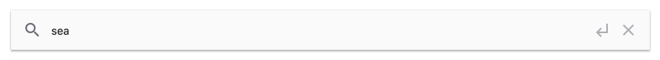

# @belcoder/angular-search

[](https://github.com/belcoder/angular-search)




```html
<nika-search [(value)]="search"
                (submitFunc)="search()"
                [isLive]="false"
                [mb]="24"></nika-search>
```

